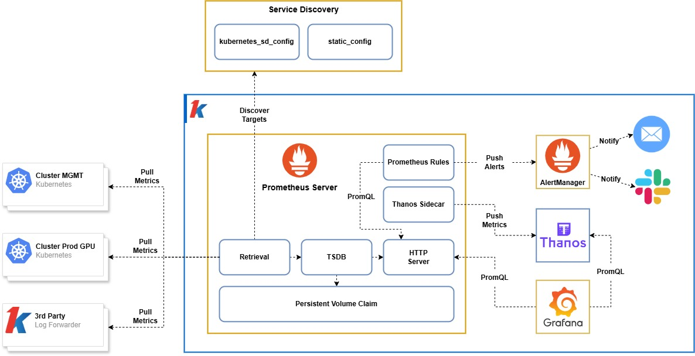

This diagram illustrates the architecture of Deka Metric and some of its ecosystem components:

## Components
The Deka Metric ecosystem consists of multiple components:

- **Prometheus** is a time-series database and monitoring system. It's designed for pull-based metric collection, querying, and alerting.
- **Alertmanager** is the component responsible for managing alerts generated by Prometheus.
- **Thanos** is a highly available, long-term storage and query layer for Prometheus.
- **Grafana** is a visualization and dashboard tool that integrates with Prometheus and many other data sources.